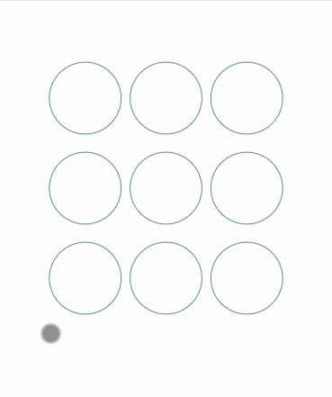

# lock

The mobile gesture unlock library, based on canvas.

## Sample

```ts
import Lock from "@chenzesam/lock";

const lock = new Lock({
  container: document.querySelector("your-dom"),
  keyboard: [3, 3]
});
```



## Options

* `container` HTMLElement: the container for place canvas.
* `keyboard` [number, number] \(*optional*): the gesture keyboard(default [3, 3]).
* `onResult` ((result: number[]) => (Promise | void)) (*optional*): will callback when the user complete operation(default null).
* `onChange` ((result: number[]) => void) (*optional*): will callback when the user touchmove new circle(default null).
* `errorDuration` number (*optional*): time(ms) of error presentation(default 2000).
* `checkInterval` number (*optional*): time(ms) of check circle transit(default 150).

## API

* `checking`: starup checking status.
* `success`: starup success status.
* `error`: starup error status.
* `destroy`: destroy it(remove DOM and unbind events).

## Roadmap

* [x] feat: 绘制功能;

* [x] feat: 完善功能(成功回调);

* [x] feat: 添加连线;

* [x] feat: 错误响应;

* [x] feat: 支持异步(promise) 检测;

* [x] doc: 代码结构优化(分离功能);

* [x] feat: 添加 error, success, loading 方法, 支持外部调用;

* [x] feat: mouse 事件改为 touch 事件;

* [x] feat: 拆分出多一层 canvas 作为 checking 交互展示;

* [x] feat: typescriptify;

* [x] feat: onChange event;

* [x] feat: add destroy method;

* [ ] feat: add test;

* [x] fix: touch 事件的 clientX 和 clientY 转为相对于容器的坐标;

* [x] fix: 父容器能滚动的情况下会导致坐标计算不准确;
